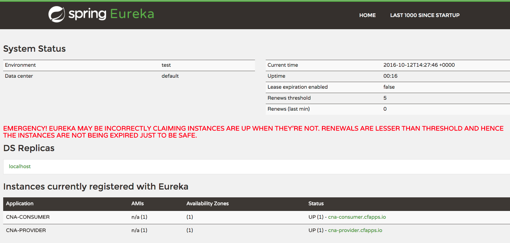
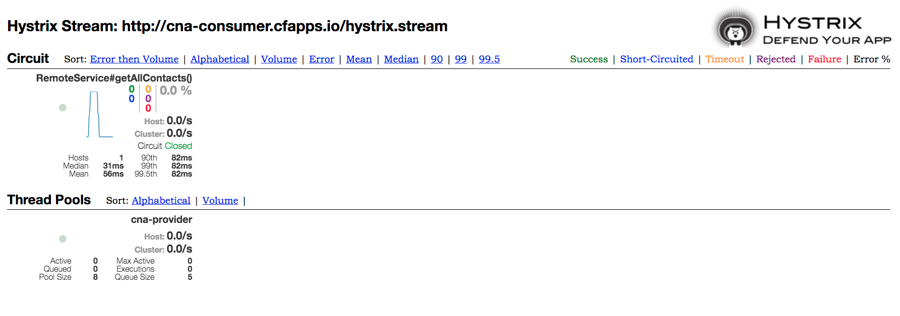
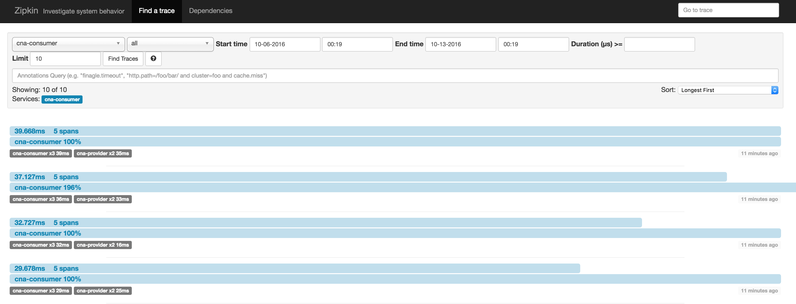

#Labs for Spring Boot and Spring Cloud
Welcome to Pivotal Cloud Native Workshop, we will use this repository for Spring Boot and Spring Cloud labs.

###Prerequisites
1. [CF command line tools](https://console.run.pivotal.io/tools) installed and login
2. Get a free [PWS account](https://login.run.pivotal.io/login), we don't mind you swipe your credit card too :)
3. [CURL](https://curl.haxx.se/download.html)
4. JDK 1.8
5. You can copy and paste, but make sure you read the remark inline

---

To save your time and resources, Config server, Eureka, Hystrix Dashboard and Zipkin have been always setup and configurated in both provider and consumer projects. 

##Lab 1 - create a simple backend microservice, let's call it a provider app, with a database, a table, and RESTful API

1. Open `01-provider-init` with your favourite IDE 

1. Add below annotation in the main class 

    ```java
    @EnableDiscoveryClient // to register and be discoverable by others
    ```

2. Add a JPA Entity class named `Contact` with below attributes and a no argument constructor, I'm using `@Data` from [Lombok](https://projectlombok.org/) below, to make the code cleaner. 

    ```java
    @Entity // JPA
    @Data @NoArgsConstructor // Lombok
    class Contact{
    	@Id @GeneratedValue // simple JPA staff
    	Long id;
    	String name;
    	String address;
    }
    ```

3. Add an `@RestResource` annotated interface extends `JpaRepository` to store the `Contact` class with a `Long` typed key 

    ```java
    @RestResource // Standard JPA staff except this annotation. It saves you a lot of effort to create RESTful API. Thanks Spring Data Rest!
    interface ContactRepository extends JpaRepository<Contact, Long>{
      // if you are familiar with JPA, feel free to add more method here, for example findAllByName. 
      // it will be appeared in http://your-consumer.cfapps.io/contacts/search
    }

    ```
    
4. To avoid hostname conflict, in manifest.yml, replace the host with your name, for example

    ```yaml
    host: cna-provider-dwong
    ```

5. package the app (`mvnw.cmd` for windows)

    ```bash
    ./mvnw clean package 
    ```

5. Create an User Provided Service by

    ```bash
    cf cups eureka-service -p '{"uri":"http://cna-eureka-service.cfapps.io"}'
    ```

5. run `cf push` to push the app (cf cli read the content in manifest.yml, save you a bit of typing)

6. Check the [Apps Manager](https://console.run.pivotal.io) 

6. Check [registry](http://cna-eureka.cfapps.io/) to see if your app is registered
 
    

7. try `/contacts` endpoint

8. You can create a new record with `HTTP POST` to the same endpoint

    ```bash
    curl -X POST your-host.cfapps.io/contacts -H 'Content-type: application/json' -d '{"name":"any name", "address":"any address"}'
    ```

9. ADVANCE: The app is using an embedded H2 database, you may also try to create a MySQL database from marketplace and bind to the app.

    ```bash
    cf create-service cleardb spark contact-db
    cf bind-service cna-provider contact-db
    cf restart cna-provider
    ```

10. Do you notice that it is not necessary to specify any host/port/credential of the database? The action bind-service does all of those, give you a 'It just works!' experience.

---

##Lab 2 - create another service to consume above microservice, let's call it consumer app

1. Open `02-consumer-init`

1. Add below annotations

    ```java
    @EnableHypermediaSupport(type = EnableHypermediaSupport.HypermediaType.HAL) // because of HATEOAS format
    @EnableFeignClients // because we will use Feign Client to consume the provider
    @EnableCircuitBreaker // because we will use circuit breaker to protect our consumer app
    @EnableDiscoveryClient // well, because we will lookup the provider app from registry
    // that's all
    ```
    
2. Add `Contact` class with the same attributes as provider (Yes, in microservice architecture, you may need duplicating class definition. However, this give you a lot more flexibility, imagine a new attribute added in provider but you don't need in your consumer app, guess what? Nothing need to be done, we call it [tolerence reader pattern!](http://martinfowler.com/bliki/TolerantReader.html). Thinking your inhouse SOA?) 

3. Add Feign Client to integrate with provider
 
    ```java
    // The name within FeignClient is the service name registered in Eureka, 
    // Feign Client will lookup the address(es) of provider.
    // Imagine there are multiple instances of provider sitting in multiple data center/cloud,
    // the client side load balancer (Ribbon) select the best one to consume.
    // If the circuit is open, the fallback class will be invoked.
    // Circuit open means something is wrong, close is normal, remember science class in sec school?
    // Not just try..catch..exception
    @FeignClient(name = "cna-provider", fallback = RemoteServiceFallback.class)
    interface RemoteService{
    
        // The /contacts request mapping below is the HTTP endpoint of provider app
        // Feign Client expect Resources of Contact from this endpoint 
    	@RequestMapping("/contacts")
    	Resources<Contact> getAllContacts(); 
    }
    ```
    
4. Implement a fallback

    ```java
    // Fallback implementation is easy, 
    // just create a class and implemnt the Feign Client interface, make sense?!
    @Component
    class RemoteServiceFallback implements RemoteService{
    	@Override
    	public Resources<Contact> getAllContacts() {
    	
    	    // just simple default thing here, 
    	    // but you can do a lot more to gracefully degrade a service
    		Contact defaultContact = new Contact();
    		defaultContact.setAddress("default");
    		defaultContact.setName("default");
    		defaultContact.setId(0L);
    		return new Resources<>(Arrays.asList(defaultContact));
    	}
    }
    ```
    
5. Add an `RestController` and an method to consume the provider service 

    ```java
    @RestController
    class SimpleController{
    
        // Thanks for Spring Boot autowiring capability, get you out of the XML hell.    
    	@Autowired RemoteService remoteService;
    	
    	// Map this method to HTTP endpoint /names
    	@GetMapping("/names")
    	public List<String> getAllNames(){
    	    // Now, really consume the provider service by calling the Feign Client method
    	    // And you don't need to worry about cascade failure
    	    // Because this service is protected by circuit breaker!
    		return remoteService.getAllContacts()
    				.getContent()
    				.stream()
    				.map(c -> c.getName()) // simple Java 8 stream
    				.collect(Collectors.toList());
    	}
    
    }
    ```
    
6. To avoid hostname conflict, in manifest.yml, replace the host with your name, for example
   
    ```yaml
    host: cna-consumer-dwong
    ```

7. package the app (`mvnw.cmd` for windows)

    ```bash
    ./mvnw clean package
    ```

8. run `cf push` to push the app

9. check [registry](http://cna-eureka.cfapps.io/) to see if your app is registered 

10. Open Hystrix dashboard [here](http://cna-hystrix.cfapps.io/hystrix)

11. Enter your Hystrix stream of this consumer app, for example

    ```
    http://cna-provider-dwong.cfapps.io/hystrix.stream
    ```
    
12. You should see the Hystrix dashboard

    
    
13. Create some requests to the `/names` endpoint and check the Hystrix dashboard again

14. Stop the provider app and continue sending request to `/names` endpoint to see the response and Hystrix dashboard

15. Restart provide app to see what happen

---
##Lab 3 - Distrubuted Tracing

1. add a sampler in main class of both provider and consumer

    ```java
    @Bean
    public AlwaysSampler defaultSampler() {
      // use always sampler here, but in production environment you want not want to keep every single trace 
      return new AlwaysSampler();
    }
    ```

2. re-package and push for both provider and consumer

    ```bash
    ./mvnw clean package && cf push 
    ```

3. Create request to consumer `/names` endpoint

4. Take a look at [Zipkin](http://cna-zipkin.cfapps.io)

    

---

Remarks:
+ Feel free to contact me by dwong@pivotal.io if any enquiry
+ Further reading: Zuul, Spring Cloud Contract, Spring Rest Docs
